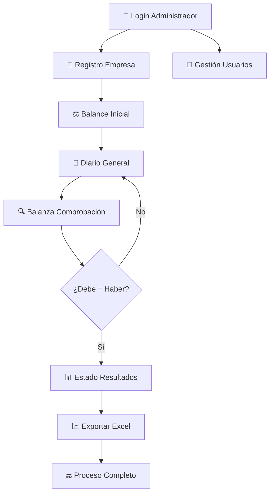

# 📋 Flujo de Trabajo - Sistema MGB Contabilidad

## 🎯 Descripción General
Este documento describe el flujo de trabajo completo para el sistema de contabilidad MGB, desde el inicio de sesión del administrador hasta la generación de reportes finales.

---

## 🔐 1. Inicio de Sesión del Administrador

### Proceso:
1. **Acceso al sistema**: El administrador accede a `login.php`
2. **Autenticación**: Ingresa email y contraseña
3. **Validación**: El sistema verifica las credenciales en la base de datos
4. **Redirección**: Si es exitoso, redirige al menú principal (`index.php`)

### Archivos involucrados:
- `login.php` - Formulario de autenticación
- `php/conexion.php` - Conexión a base de datos
- `index.php` - Menú principal del sistema

### Sesiones creadas:
- `$_SESSION['usuario_id']`
- `$_SESSION['usuario_nombre']`
- `$_SESSION['usuario_rol']`

---

## 🏢 2. Registro de Empresa

### Proceso:
1. **Acceso**: Desde el menú principal, clic en "Registro de Empresa"
2. **Formulario**: Completar datos de la empresa (nombre, NIT, dirección, etc.)
3. **Validación**: El sistema valida la información ingresada
4. **Almacenamiento**: Los datos se guardan en la base de datos

### Archivo principal:
- `registro_empresa.php`

### Datos requeridos:
- Nombre de la empresa
- NIT/RUC
- Dirección
- Teléfono
- Email corporativo
- Representante legal

---

## ⚖️ 3. Balance Inicial

### Proceso:
1. **Selección de empresa**: Elegir la empresa registrada
2. **Configuración inicial**: Establecer el periodo contable
3. **Registro de cuentas**: Ingresar el catálogo de cuentas inicial
4. **Saldos iniciales**: Registrar los saldos de apertura
5. **Validación**: Verificar que la suma del debe = suma del haber

### Archivo principal:
- `balance_inicial.php`

### Elementos clave:
- **Activos**: Caja, bancos, inventarios, cuentas por cobrar, etc.
- **Pasivos**: Cuentas por pagar, préstamos, etc.
- **Patrimonio**: Capital, utilidades retenidas, etc.

### Regla fundamental:
```
ACTIVOS = PASIVOS + PATRIMONIO
```

---

## 📖 4. Diario General

### Proceso:
1. **Selección del balance**: Elegir el balance inicial creado anteriormente
2. **Registro de transacciones**: Ingresar movimientos contables diarios
3. **Partida doble**: Cada asiento debe tener debe = haber
4. **Validación automática**: El sistema verifica la igualdad contable

### Archivo principal:
- `diario_general.php`

### Tipos de transacciones:
- Ventas
- Compras
- Gastos
- Ingresos
- Transferencias bancarias
- Ajustes contables

### Formato de asiento:
```
FECHA | CUENTA | DEBE | HABER | CONCEPTO
```

---

## 🔍 5. Balanza de Comprobación

### Proceso:
1. **Generación automática**: El sistema compila todas las transacciones
2. **Verificación de saldos**: Confirma que debe = haber por cada cuenta
3. **Detección de errores**: Identifica discrepancias contables
4. **Corrección**: Permite hacer ajustes si es necesario

### Archivo principal:
- `balanza_comprobacion.php`

### Validaciones:
- ✅ Suma total del debe = Suma total del haber
- ✅ Saldos por cuenta correctos
- ✅ Clasificación contable apropiada

### Estructura de la balanza:
```
CUENTA | SALDO INICIAL | DEBE | HABER | SALDO FINAL
```

---

## 📊 6. Estado de Resultados

### Proceso:
1. **Selección de parámetros**: Elegir empresa y año fiscal
2. **Cálculo automático**: El sistema procesa ingresos y gastos
3. **Generación del reporte**: Muestra la utilidad o pérdida del ejercicio
4. **Exportación**: Opción para exportar a Excel

### Archivo principal:
- `estado_resultados.php`

### Componentes:
- **Ingresos operacionales**
- **Costos de ventas**
- **Utilidad bruta**
- **Gastos operacionales**
- **Utilidad operacional**
- **Ingresos y gastos no operacionales**
- **Utilidad neta**

### Fórmula básica:
```
UTILIDAD NETA = INGRESOS - GASTOS - COSTOS
```

---

## 📈 7. Exportación a Excel

### Proceso:
1. **Selección de reporte**: Elegir qué información exportar
2. **Formato Excel**: El sistema genera archivo .xlsx
3. **Descarga**: El archivo se descarga automáticamente

### Archivo principal:
- `php/exportar_excel.php`

### Reportes exportables:
- Estado de resultados
- Balance general
- Balanza de comprobación
- Diario general

---

## 👥 8. Gestión de Usuarios

### Proceso:
1. **Acceso administrativo**: Solo usuarios con rol 'admin'
2. **Registro de usuarios**: Crear nuevos usuarios del sistema
3. **Asignación de roles**: Definir permisos (admin, contador, consulta)
4. **Gestión de accesos**: Activar/desactivar usuarios

### Archivo principal:
- `usuarios.php`

### Roles disponibles:
- **Admin**: Acceso completo al sistema
- **Contador**: Puede registrar transacciones y generar reportes
- **Consulta**: Solo puede ver reportes

---

## 🔄 Flujo Completo - Diagrama



---

## 📁 Archivos del Sistema

| Archivo | Descripción | Función Principal |
|---------|-------------|-------------------|
| `login.php` | Autenticación | Inicio de sesión |
| `index.php` | Menú principal | Navegación |
| `registro_empresa.php` | Registro empresas | Datos corporativos |
| `balance_inicial.php` | Balance apertura | Saldos iniciales |
| `diario_general.php` | Libro diario | Transacciones |
| `balanza_comprobacion.php` | Verificación | Control contable |
| `estado_resultados.php` | P&G | Rentabilidad |
| `usuarios.php` | Administración | Gestión usuarios |
| `php/exportar_excel.php` | Exportación | Reportes Excel |

---

## 🎯 Objetivos del Sistema

1. **Automatizar** el proceso contable básico
2. **Garantizar** la integridad de la información financiera
3. **Facilitar** la generación de reportes contables
4. **Controlar** el acceso mediante roles de usuario
5. **Exportar** información para análisis externo

---

## 📋 Checklist de Proceso Completo

- [ ] ✅ Administrador inicia sesión
- [ ] 🏢 Empresa registrada en el sistema
- [ ] ⚖️ Balance inicial configurado y balanceado
- [ ] 📖 Transacciones registradas en diario general
- [ ] 🔍 Balanza de comprobación verificada (debe = haber)
- [ ] 📊 Estado de resultados generado por empresa/año
- [ ] 📈 Reporte exportado a Excel
- [ ] 👥 Usuarios adicionales registrados (opcional)

---

## 🚨 Puntos Críticos de Control

1. **Balance inicial**: Debe estar perfectamente balanceado antes de continuar
2. **Partida doble**: Cada transacción debe cumplir debe = haber
3. **Balanza de comprobación**: Verificación obligatoria antes del estado de resultados
4. **Permisos de usuario**: Solo administradores pueden gestionar usuarios
5. **Integridad de datos**: Validaciones en cada paso del proceso

---

## 📞 Soporte Técnico

Para dudas sobre el flujo de trabajo, contactar al equipo de desarrollo de MGB Contabilidad.

**Última actualización**: Julio 2025
**Versión del documento**: 1.0
