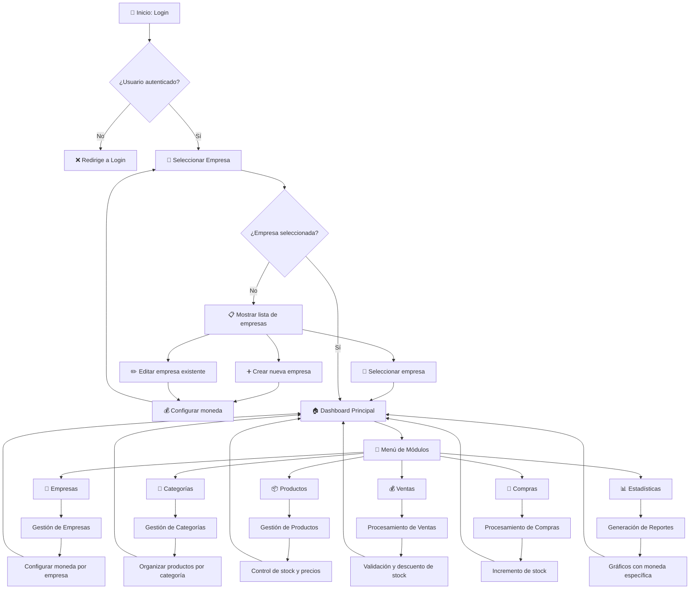
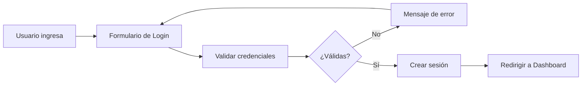
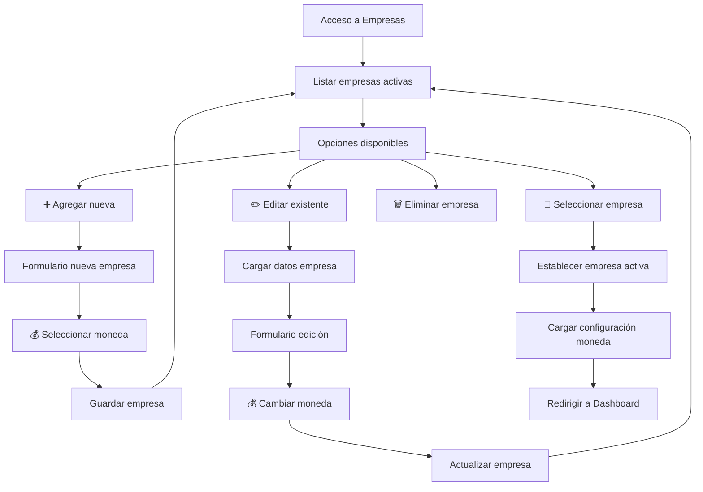
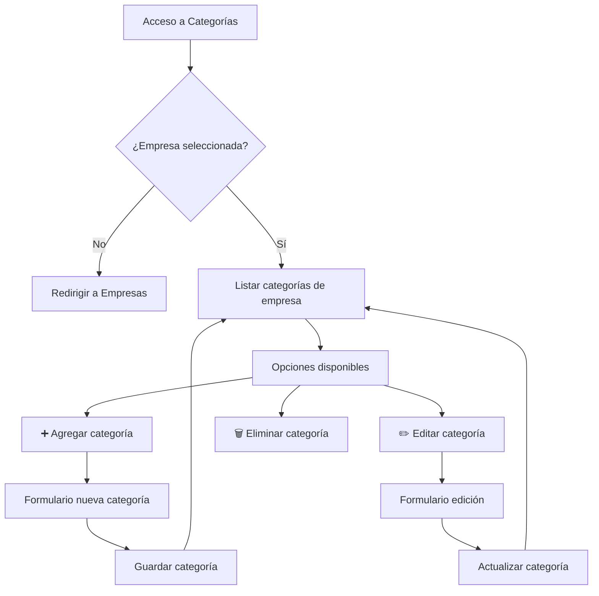
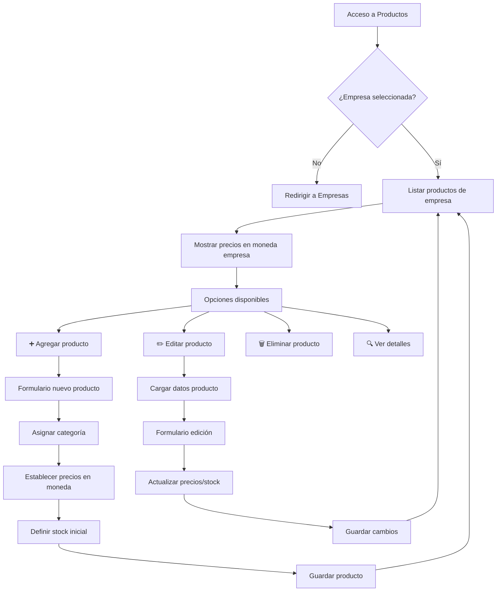
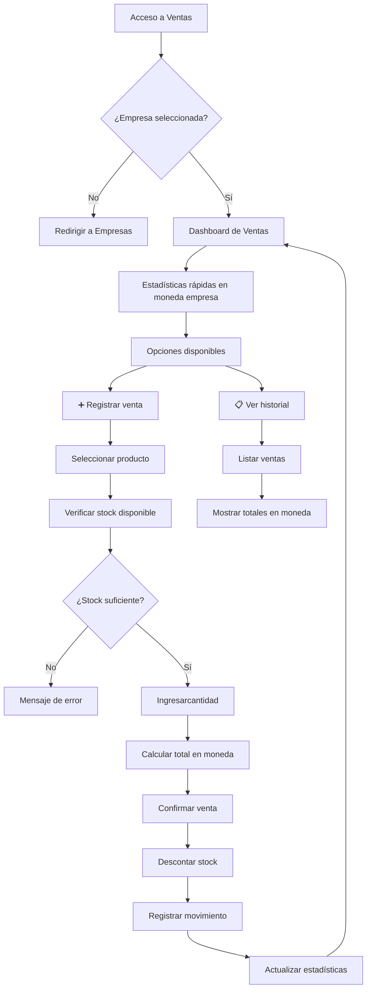
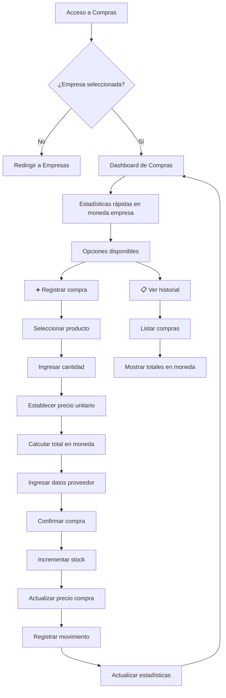
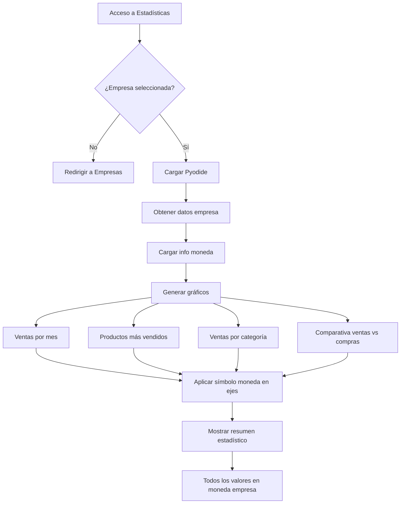
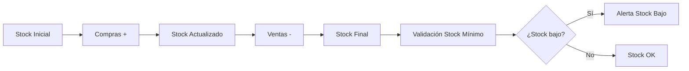

# MGBStock - Flujo de Trabajo del Sistema

Este documento describe el flujo de trabajo completo del sistema de inventario multiempresa MGBStock, desde el acceso inicial hasta la gestión avanzada de inventario y estadísticas.

## 📊 Diagrama de Flujo Principal



## 🔄 Flujo Detallado por Módulos

### 1. 🔐 Módulo de Autenticación



**Proceso:**
1. Usuario accede a `index.php`
2. Ingresa credenciales (por defecto: admin/admin123)
3. Sistema valida contra base de datos
4. Si es válido, crea sesión y redirige al dashboard

### 2. 🏢 Módulo de Empresas



**Características clave:**
- **Configuración de moneda**: Cada empresa puede tener su propia moneda
- **Monedas disponibles**: Peso Mexicano (por defecto), Sol Peruano, Dólar, Euro, etc.
- **Efecto global**: Al seleccionar empresa, toda la aplicación usa su moneda

### 3. 📂 Módulo de Categorías



**Características:**
- Categorías específicas por empresa
- Organización de productos por tipo/familia
- Base para reportes por categoría

### 4. 📦 Módulo de Productos



**Características:**
- Control de stock en tiempo real
- Precios en moneda de la empresa
- Códigos únicos por empresa
- Alertas de stock bajo

### 5. 💰 Módulo de Ventas



**Características:**
- Validación automática de stock
- Cálculos en moneda de la empresa
- Descuento automático de inventario
- Registro de movimientos para auditoría

### 6. 🛒 Módulo de Compras



**Características:**
- Incremento automático de stock
- Actualización de precios de compra
- Registro de proveedores
- Cálculos en moneda de la empresa

### 7. 📊 Módulo de Estadísticas



**Características:**
- Gráficos generados con Python/Matplotlib
- Todos los valores en moneda de la empresa
- Análisis temporal y por categorías
- Comparativas financieras

## 🔄 Flujo de Datos del Sistema

### Control de Stock



### Flujo de Monedas

```mermaid
flowchart LR
    A[Empresa seleccionada] --> B[Cargar config moneda]
    B --> C[Aplicar en formatPrice()]
    C --> D[Mostrar en UI]
    D --> E[Usar en gráficos]
    E --> F[Mostrar en reportes]
```

## 🎯 Casos de Uso Típicos

### Caso 1: Empresa Mexicana
1. **Login** → Credenciales admin/admin123
2. **Seleccionar** → Comercial El Dorado
3. **Resultado** → Todo el sistema muestra precios en $ (Peso Mexicano)
4. **Ventas** → Registra venta: $ 1,899.99
5. **Estadísticas** → Gráficos muestran "Total de Ventas ($)"

### Caso 2: Empresa Peruana
1. **Login** → Credenciales admin/admin123
2. **Seleccionar** → TechnoSoft S.A.
3. **Resultado** → Todo el sistema muestra precios en S/ (Sol Peruano)
4. **Ventas** → Registra venta: S/ 2,599.99
5. **Estadísticas** → Gráficos muestran "Total de Ventas (S/)"

### Caso 3: Crear Nueva Empresa
1. **Empresas** → Agregar Empresa
2. **Datos** → Nombre, dirección, contacto
3. **Moneda** → Seleccionar de lista (Peso Mexicano por defecto)
4. **Guardar** → Empresa creada con su moneda
5. **Usar** → Seleccionar empresa y trabajar con su moneda

## 📋 Checklist de Operaciones

### ✅ Operaciones Diarias
- [ ] Seleccionar empresa activa
- [ ] Registrar ventas del día
- [ ] Registrar compras recibidas
- [ ] Verificar stock bajo
- [ ] Revisar estadísticas

### ✅ Operaciones Semanales
- [ ] Generar reportes de ventas
- [ ] Analizar productos más vendidos
- [ ] Revisar movimientos de stock
- [ ] Actualizar precios si es necesario

### ✅ Operaciones Mensuales
- [ ] Generar gráficos estadísticos
- [ ] Comparar ventas vs compras
- [ ] Evaluar rendimiento por categoría
- [ ] Planificar compras futuras

## 🔧 Configuración Técnica

### Requisitos Previos
- Servidor web con PHP 7.4+
- Base de datos MySQL 5.7+
- Navegador moderno con JavaScript

### Instalación
1. Copiar archivos al servidor
2. Crear base de datos con `mgbstock.sql`
3. Configurar conexión en `config.php`
4. Acceder vía navegador

### Migración (si ya existe)
1. Respaldar base de datos
2. Ejecutar `migration_currency.sql`
3. Verificar funcionalidad

---

## 🎯 Beneficios del Flujo de Trabajo

1. **Simplicidad**: Flujo intuitivo y fácil de seguir
2. **Flexibilidad**: Soporte para múltiples empresas y monedas
3. **Automatización**: Stock y movimientos automáticos
4. **Trazabilidad**: Historial completo de operaciones
5. **Reportes**: Estadísticas en tiempo real con gráficos
6. **Escalabilidad**: Fácil agregar nuevas empresas y monedas

El sistema MGBStock está diseñado para ser intuitivo y eficiente, permitiendo a los usuarios gestionar inventarios multiempresa de forma sencilla y con total control sobre las monedas utilizadas en cada operación.
